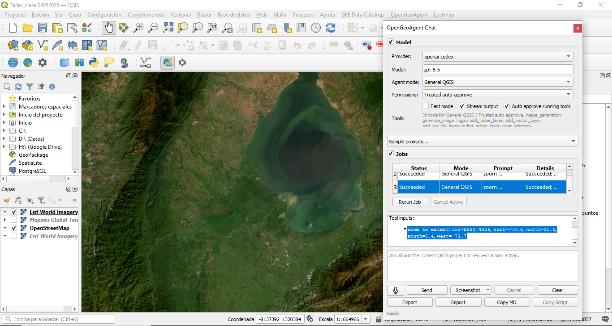
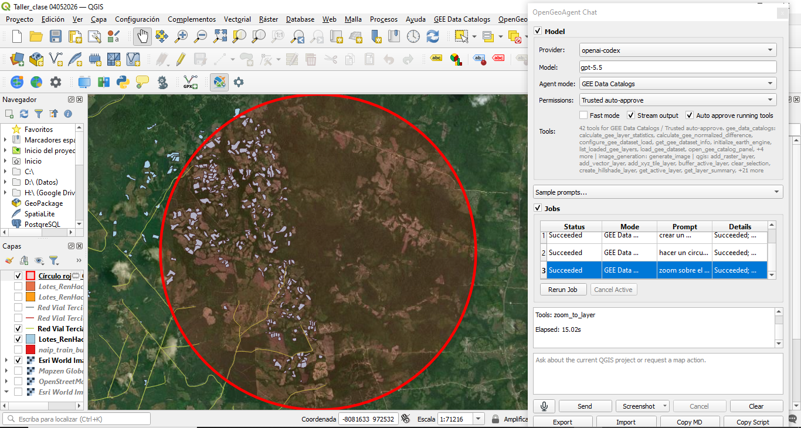

# Introducción

Los Sistemas de Información Geográfica (SIG) han evolucionado significativamente en los últimos años mediante la incorporación de herramientas de automatización, inteligencia artificial y conexión con plataformas de análisis geoespacial en la nube. En este contexto, QGIS se ha consolidado como uno de los software SIG de código abierto más utilizados a nivel académico, investigativo y profesional, gracias a su flexibilidad y amplia disponibilidad de complementos o *plugins* especializados.

El presente taller, titulado **“Taller en clase Plugins - Mr. Qiusheng Wu”**, tiene como propósito introducir el proceso de instalación, configuración y uso de diferentes complementos avanzados en QGIS, orientados al análisis espacial, procesamiento de datos geográficos y automatización de tareas mediante inteligencia artificial y servicios en la nube.

Como parte del desarrollo de la práctica, se realizará la instalación y exploración de los plugins **OpenGeoAI/OpenGeoAgent**, **Google Earth Engine (GEE)** y **GeoAI**, herramientas que amplían considerablemente las capacidades de QGIS para el manejo de información geoespacial. Estos complementos permiten integrar modelos de inteligencia artificial, procesamiento remoto de imágenes satelitales, automatización de consultas espaciales y análisis geográficos asistidos mediante lenguaje natural.

El plugin **OpenGeoAgent** facilita la interacción entre QGIS y modelos de inteligencia artificial, permitiendo ejecutar tareas de análisis, generación de código y procesamiento geoespacial automatizado directamente desde el entorno SIG. Por su parte, el complemento de **Google Earth Engine (GEE)** permite acceder y procesar grandes volúmenes de información satelital y geoespacial almacenados en la nube, integrando capacidades avanzadas de análisis raster y monitoreo ambiental. Finalmente, el plugin **GeoAI** incorpora funcionalidades basadas en inteligencia artificial para clasificación, segmentación y análisis automatizado de información espacial.

La implementación de estas herramientas representa un avance importante en los flujos modernos de geomática y análisis territorial, ya que permite optimizar tiempos de procesamiento, mejorar la eficiencia en el análisis espacial y facilitar la integración entre SIG, computación en la nube e inteligencia artificial aplicada al territorio.

---

# Objetivos

## Objetivo general

Instalar, configurar y utilizar complementos especializados en QGIS orientados al análisis geoespacial, automatización de procesos e integración con herramientas de inteligencia artificial y computación en la nube, mediante el uso de los plugins OpenGeoAgent, Google Earth Engine (GEE) y GeoAI.

## Objetivos específicos

- Instalar y configurar correctamente los plugins OpenGeoAgent, Google Earth Engine (GEE) y GeoAI dentro del entorno de trabajo de QGIS.

- Reconocer las funcionalidades, aplicaciones y alcances de cada complemento en procesos de análisis geoespacial y procesamiento de información territorial.

- Integrar servicios de computación en la nube y herramientas de inteligencia artificial para el análisis y visualización de datos espaciales.

- Ejecutar procesos básicos de consulta, visualización y procesamiento de información geográfica mediante los plugins instalados.

- Evaluar el potencial de los complementos de inteligencia artificial y análisis automatizado en el desarrollo de flujos de trabajo geomáticos modernos.

- Fortalecer las competencias técnicas en el manejo de herramientas SIG avanzadas aplicadas al procesamiento y análisis espacial.

---

# Área de estudio: Región del Catatumbo, Norte de Santander – Colombia

El área de estudio corresponde a la región del Catatumbo, ubicada en el departamento de Norte de Santander, al nororiente de Colombia, en zona limítrofe con Venezuela. Esta región se caracteriza por presentar una compleja dinámica territorial asociada a procesos de sustitución de cultivos, conectividad vial limitada, alta diversidad ambiental y una topografía predominantemente montañosa y selvática.

El Catatumbo constituye una zona estratégica desde el punto de vista social, económico y ambiental, debido a la presencia de corredores de movilidad rural, áreas de producción agrícola y sectores con restricciones de accesibilidad. Estas condiciones hacen necesario el uso de herramientas geomáticas y análisis geoespacial para la evaluación de infraestructura vial, conectividad territorial y optimización logística.

Geográficamente, el área de estudio se localiza aproximadamente entre las siguientes coordenadas:

- **Latitud:** 7°00' N – 9°00' N  
- **Longitud:** 72°00' O – 74°00' O  

La región comprende municipios pertenecientes a la subregión del Catatumbo, entre los que se destacan Tibú, El Tarra, Convención, Teorama, Sardinata y San Calixto, áreas que presentan importantes retos en términos de accesibilidad, planificación territorial y desarrollo de infraestructura. La complejidad del territorio, la diversidad de actores y la necesidad de mejorar la conectividad hacen que el análisis geoespacial sea una herramienta fundamental para la toma de decisiones en esta región, orientada a optimizar rutas logísticas, identificar áreas prioritarias para intervención y fortalecer la competitividad de los productos agrícolas.

---

# Instalación de Plugins en QGIS

Los plugins o complementos en QGIS corresponden a herramientas adicionales que permiten ampliar las funcionalidades del software mediante la incorporación de nuevas capacidades de análisis, procesamiento y visualización de información geoespacial. Estos complementos facilitan la integración de tecnologías avanzadas como inteligencia artificial, procesamiento en la nube, automatización de tareas y conexión con plataformas externas de datos geográficos.

En el desarrollo de la presente práctica se realizó la instalación y configuración de diferentes plugins especializados, orientados al fortalecimiento de los procesos de análisis espacial y automatización de flujos de trabajo geomáticos.

## OpenGeoAgent

OpenGeoAgent es un plugin de inteligencia artificial diseñado para integrarse con QGIS y facilitar la interacción entre el usuario y herramientas avanzadas de análisis geoespacial mediante lenguaje natural. Este complemento permite automatizar tareas SIG, generar consultas espaciales, apoyar la creación de código y optimizar procesos de análisis territorial dentro del entorno de QGIS.

El plugin incorpora capacidades de asistencia inteligente para el procesamiento de datos geográficos, facilitando operaciones relacionadas con geoprocesamiento, visualización cartográfica, manejo de capas y ejecución de análisis espaciales. Además, representa una herramienta innovadora para la integración entre Sistemas de Información Geográfica (SIG) e inteligencia artificial aplicada a la geomática.

La instalación del plugin se realizó desde el administrador de complementos de QGIS, mediante la búsqueda e instalación del complemento OpenGeoAgent/OpenGeoAI desde el repositorio oficial de plugins.

{#fig-mapa-nieve fig-align="center" width="70%"}

{#fig-mapa-nieve fig-align="center" width="70%"}

---

# Google Earth Engine (GEE)

Google Earth Engine (GEE) es una plataforma de computación geoespacial basada en la nube, desarrollada por Google, que permite el almacenamiento, procesamiento y análisis de grandes volúmenes de información geográfica y satelital. Esta herramienta integra un extenso catálogo de imágenes y datos espaciales provenientes de diferentes misiones satelitales, tales como Landsat, Sentinel, MODIS, entre otras, facilitando el desarrollo de análisis ambientales, territoriales y multitemporales de manera eficiente.La integración de Google Earth Engine con QGIS mediante su plugin oficial permite conectar el entorno SIG de escritorio con las capacidades de procesamiento en la nube de GEE, optimizando los flujos de trabajo asociados al análisis espacial y teledetección. A través de este complemento es posible visualizar imágenes satelitales, ejecutar scripts, acceder a colecciones de datos geoespaciales y realizar procesos de análisis raster sin necesidad de descargar grandes volúmenes de información localmente.El uso de Google Earth Engine representa una herramienta fundamental en aplicaciones relacionadas con monitoreo ambiental, análisis de cobertura y uso del suelo, detección de cambios, evaluación de recursos naturales y gestión territorial. Además, su capacidad de procesamiento distribuido permite ejecutar análisis complejos sobre extensas áreas geográficas en tiempos considerablemente reducidos.En el desarrollo del presente taller se realizó la instalación y configuración del plugin de Google Earth Engine en QGIS, con el propósito de explorar sus funcionalidades básicas y fortalecer las competencias en el uso de plataformas de análisis geoespacial en la nube aplicadas a la geomática.

{#fig-mapa-nieve fig-align="center" width="70%"}

{#fig-mapa-nieve fig-align="center" width="70%"}

# GEOAI

Se utiliza la herramienta GEOAI con los mapas base que se tienen para el proyecto en donde se utiliza la capa de pendientes que se implemento para el taller de analisis de modelos de QGIS, para este caso se cargo dentro del GEOAI "PENDIENTES". Para este caso se utiliza el Model : Caption, el prompt: Pendientes y el Lenght: Normal.
Para el el Export Training Data, se genera:

- Format: PASCAL_VOC
- Tile Size: 640

Finalmente se obtiene:

*This figure presents a detailed topographic and geological representation of the study area using a color palette composed of brown, beige, gray, and blue tones. The map displays a three-dimensional appearance through shading and elevation variations, allowing the visualization of terrain morphology and relief characteristics. Hydrological features such as rivers and streams are represented in blue, contrasting with the surrounding land surfaces. Additionally, several green points are distributed throughout the map, indicating locations or features of particular interest associated with the geological or territorial analysis. The map is oriented with north at the top and includes a scale bar, place labels, and a legend that provides additional information regarding the represented spatial features and symbology.*

{#fig-mapa-nieve fig-align="center" width="70%"}

